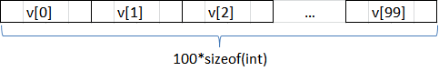
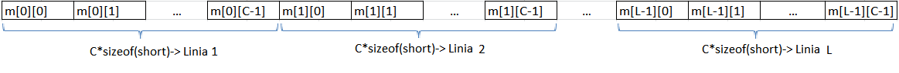

# Laboator 5

## Tablouri

Adresa unui element al unui tablou este formată din
- adresa de început a tabloului
- deplasamentul elementului în cadrul tabloului

Exprimarea acestora:
- adresa de început a tabloului
    - prin numele variabilei tablou
- deplasamentul elementului în cadrul tabloului
    - constantă
    - registru
    - eventual combinații
    - nu o altă variablă din memorie

### Legatura dintre tablouri si pointeri
Numele unui tablou este un pointer constant spre primul sau element.
Expresiile de mai jos sunt deci echivalente:

- nume_tablou
- &nume_tablou
- &nume_tablou[0]
- *nume_tablou
- nume_tablou[0]

### Instructiunea LEA (Load Effective address)
Realizeaza "incarcarea" in operandul destinatie a adresei obiectului din operandul sursa.

Sintaxa: `lea dest, sursa`

### Vector 1D
```cpp
int v[100];    // static
int* v = (int*)malloc(100*sizeof(int));    // dinamic
```



Accesarea elementelor unui vector
```cpp
v[i] = 5;
*(v+i) = 5;
*((int*)((unsigned)v + sizeof(int)*i)) = 5;

_asm {
    LEA edi, v
    MOV ecx, i
    MOV dword ptr [edi + 4*ecx], 5  
}
```

### Vectori 2D(Matrice)
```cpp
#define L 100
#define C 50
short m[L][C];
```


Accesarea elementelor unei matrici

In cazul unei matrici de m[L][C] (L * C elemente de tip short), pentru avea acces la elementul de pe pozitia [i][j] (linia i, coloana j), va trebui sa aflam adresa acestuia.

"m[i][j]" este echivalent cu: "&m + (i*C+j)*2" (adresa primului element la care adaugam (i * nr_coloane + j), totul inmultit cu dimensiunea elementelor, in cazul nostru 2 octeti pentru short)

```cpp
m[i][j] = 5;
*(((short*)m[i]) + j) = 5;
*((short*)m + i*C + j) = 5;
*((short*)((unsigned)m + i*C*sizeof(short) + j*sizeof(short))) = 5;

_asm {
    LEA edi, m
    mov eax, C
    mov ebx, i
    mov ecx, j
    mul ebx
    add eax, ecx
    shl eax, 1
    add edi, eax
    mov dword ptr [edi], 5
}
```


Transmiterea matricei ca parametru unei functii
```cpp
#include <stdio.h>
#include <malloc.h>
#define L 10
#define C 20

int f(int m[][C])
{
  // functia returneaza valoarea lui m[0][0]
  _asm
  {
    mov eax, [ebp+8]
    mov eax, [eax]
  }
}

void main()
{
    int m[L][C];
    m[0][0] = 1024000;
    int x = f(m); // vectorii si matricele se transmit prin referinta
    printf("%d\n",x); // se afiseaza 1024000
}
```


## Structuri

- adresa unui câmp al unei structuri este formată din
    - adresa de început a structurii
    - deplasamentul câmpului în cadrul structurii
- similar tablourilor
- dar câmpurile unei structuri pot fi de tipuri diferite
    - deplasamentul nu mai este dat de un indice

### Alinierea structurilor

- deplasamentul unui câmp - multiplu de dimensiunea sa
    - consecință - pot exista goluri (octeți neutilizați) între câmpuri
    - iar dimensiunea structurii poate fi mai mare decât suma dimensiunilor câmpurilor

```cpp
struct S {
    char a,b;
    int c;
} s;
```
- dimensiunea variabilei s de tip S - 8 octeți
- deplasamente: a - 0, b - 1, c - 4

### Accesul la campuri

- cod C
```cpp
s.a=7;
s.c=22;
```
- traducere în limbaj de asamblare
```cpp
mov byte ptr s,7
mov dword ptr s+4,22
// sau mov dword ptr s[4],22
```

### Structuri ca parametri de funcții

- limbajul C nu permite transmiterea de structuri ca parametri ai unor funcții
    - doar pointeri la structuri
- în limbajul C++ este posibil
- cum traducem operatorul -> ?
    - determinarea deplasamentului
    - dereferențierea

- cod C
```cpp
S *p=new S;
p->b=11;
```
- traducere în limbaj de asamblare
```cpp
mov eax,p
mov byte ptr [eax+1],11
```

## Exercitii
1. Interschimbarea a 2 valori
```cpp
#include <stdio.h>

void swap (int *a, int *b)
{
     _asm
     {
        // completati
     }
}

void main()
{
    int a=2, b=3;
    swap(&a, &b);
    printf("%d %d", a, b);
}
```

2. Lungimea unui sir de caractere (un sir de caractere se termina cu valoarea 0)
```cpp
#include <stdio.h>
int lungime(char *)
{
     _asm
     {
        // completati
     }
}

void main()
{
     char *sir="zigyzagy";
     int l;

     _asm
     {
        // completati
     }

     printf("Lungime: %d %d\n", l, strlen(sir));
}
```

3. Suma elementelor pare dintr-un vector
```cpp
#include <stdio.h>

int suma_pare_vector (int *, int )
{
     _asm
     {
        // completati
     }
}

void main()
{
     int v[5]={5,1,2,3,6};
     int *p=v;
     int s;

     _asm
     {
        // completati
     }

     printf("Suma: %d", s);
}
```

5. Construirea matricii unitate (1 pe diagonala, 0 in rest)
```cpp
#include <stdio.h>

void matrice_unitate(int *, int )
{
     _asm
     {
        // completati
     }
}

void main()
{
     int n=5;
     int mat[5][5];
     int *p = mat[0];

     _asm
     {
        // completati
     }

     for(int i=0; i<n; i++)
     {
         for(int j=0; j<n; j++)
            printf("%d ", mat[i][j]);
         printf ("\n");
     }
}
```